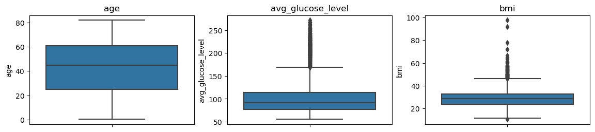
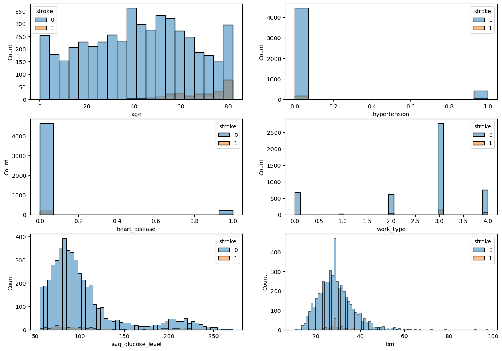
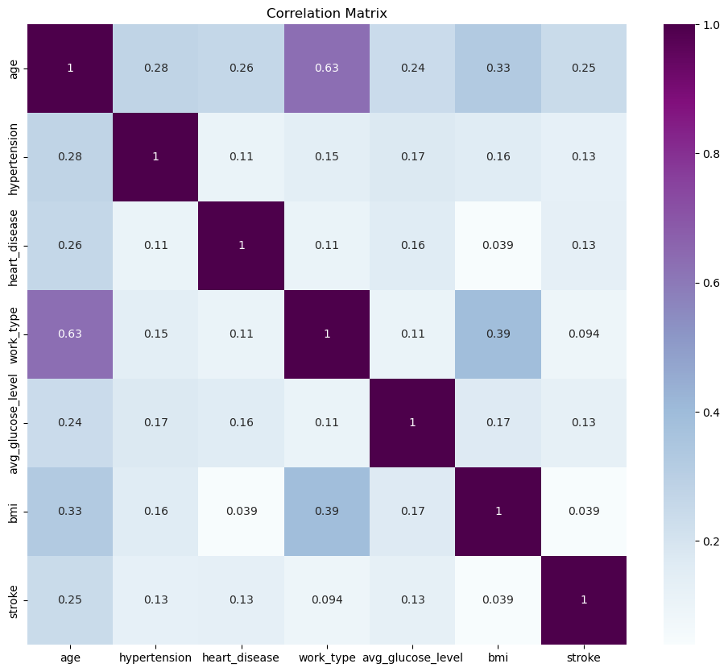
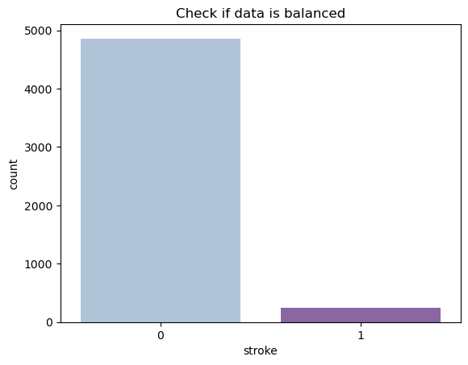
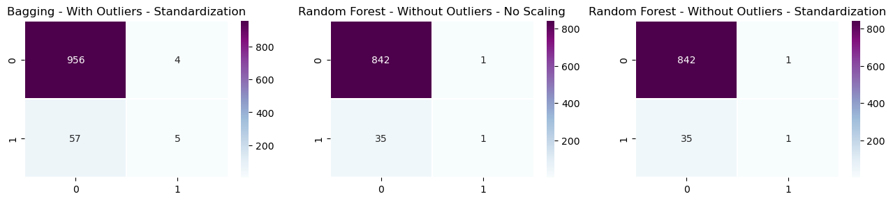

# Machine Learning Project: Stroke Prediction

## Authors

[Lidia Mayor](https://www.linkedin.com/in/lidia-mayor-sanjuan-3b350930b/) & [Adrián Lardiés](https://www.linkedin.com/in/adrianlardies/)


## Project Description

The goal of this project is to demonstrate a complete data prediction process using Machine Learning algorithms, from data exploration and cleaning to visualization, model training, and evaluation. Class balancing techniques, such as SMOTE and SMOTEENN, are applied in an attempt to improve the performance of the models in imbalanced datasets.

The dataset used contains medical and demographic information of patients, with features such as age, glucose level, hypertension, among others, and the main goal is to predict whether a patient will have a stroke based on these characteristics.

The project is divided into two main parts:

1. **Analysis without class balancing:** Initially, models are trained using the original dataset, which has a significant class imbalance.
2. **Analysis using SMOTE and SMOTEENN:** We then apply the SMOTE and SMOTEENN oversampling techniques to balance the classes and retrain the models, comparing the results.

## Dataset

The dataset used for this project is publicly available on Kaggle. You can access it [here](https://www.kaggle.com/datasets/fedesoriano/stroke-prediction-dataset/data).

The dataset is located in the `healthcare-dataset-stroke-data.csv` file inside the `data/` folder. It contains 12 columns and 5110 rows. The key variables are:

- `age`: Age of the patient.
- `hypertension`: Indicates whether the patient has hypertension.
- `heart_disease`: Indicates whether the patient has heart disease.
- `avg_glucose_level`: Average blood glucose level.
- `bmi`: Body Mass Index.
- `stroke`: Target variable indicating whether the patient has had a stroke (1) or not (0).

## Project Structure

The project is organized as follows:

- **data/**: Contains the original dataset.
- **images/**: Folder containing images used in the README for data visualization and model results.
- **[lib/functions.py](https://github.com/lidiamayor/MachineLearning-project/tree/main/lib)**: File with custom functions for data cleaning, visualization, and model evaluation.
- **[notebook/machinelearning.ipynb](https://github.com/lidiamayor/MachineLearning-project/blob/main/notebook/machinelearning.ipynb)**: Jupyter notebook showcasing the entire workflow, from data exploration to model analysis, class balancing, and final model evaluation.
- **[src/main.py](https://github.com/lidiamayor/MachineLearning-project/blob/main/src/main.py)**: Script that cleans the data and trains and save the final model.
- **[model/stroke_model.pkl](https://github.com/lidiamayor/MachineLearning-project/tree/main/model)**: Serialized trained model used by the Streamlit app for making predictions.
- **[app.py](https://github.com/lidiamayor/MachineLearning-project/blob/main/app.py)**: Streamlit application that allows users to input data and receive stroke predictions based on the trained model.
- **[requirements.txt](https://github.com/lidiamayor/MachineLearning-project/blob/main/requirements.txt)**: File containing the necessary dependencies to run the Streamlit app and the project.
- **README.md**: File containing the project description and instructions on how to run it.


## Requirements

To run this project, make sure you have the following dependencies installed:

- pandas
- matplotlib
- seaborn
- scikit-learn
- imbalanced-learn
- tensorflow
- jinja2
- streamlit
- ipykernel

You can install all the dependencies by running the following command in your terminal:

```bash
pip install -r requirements.txt
```

## Project Contents

### 1. Data Exploration

- Inspect the dataset for missing values and duplicates.
- Handle missing values (imputation for Body Mass Index - BMI) and remove duplicates.
- Transform categorical variables into numerical values (gender, work type, etc.).
- Identify outliers in key columns like BMI and glucose levels.




### 2. Data Visualization

### 2. Data Visualization

- Create histograms and boxplots to analyze data distribution and detect outliers.



- Generate a correlation matrix to identify relationships between variables.



- Analyze class distribution, highlighting the significant imbalance between patients who had a stroke and those who did not.



### 3. Machine Learning Models

The following classification algorithms were tested:

- Logistic Regression
- Decision Tree
- Random Forest
- SVM
- KNN
- Naive Bayes
- Bagging
- AdaBoost

The models were evaluated in multiple configurations:

- With and without outliers.
- Different scaling techniques: No scaling, standardization, and normalization.
- With and without class balancing (using SMOTE and SMOTEENN techniques).

### 4. Model Evaluation

The metrics used to evaluate the models were:

- **Accuracy**
- **Precision** (most important for minimizing false negatives)
- **Recall**
- **F1-score**

Comparisons between results with and without applying SMOTE and SMOTEENN show how class balancing techniques attempt to improve performance, particularly in predicting the minority class (stroke = 1). However, the best performance was achieved without balancing the classes.

## Conclusions

- **Without Class Balancing:** Models trained on the imbalanced dataset, especially Random Forest and Bagging, provided the best results in terms of precision, which was crucial for minimizing false negatives. Techniques like SMOTE and SMOTEENN, while improving recall, led to an increase in false positives.


  
- **With Class Balancing (SMOTE, SMOTEENN):** Although recall improved, these techniques led to a drop in precision, increasing false positives. As a result, the models without class balancing performed better in terms of precision and overall F1-score.

This project highlights the importance of selecting the appropriate metrics based on the problem's goals. In critical cases like stroke prediction, precision is key to minimizing false negatives, and class balancing techniques did not offer the best results for this objective.


## Streamlit App

You can interact with the Stroke Prediction App using the following [Streamlit link](https://machinelearning-project-stroke.streamlit.app/).


## Presentation

You can view the presentation that summarizes the project, its findings, and key takeaways at the following [link to the presentation](https://www.canva.com/design/DAGTLZEvpiM/2ELp9jOYxkgX2DVXtMmRyQ/view?utm_content=DAGTLZEvpiM&utm_campaign=designshare&utm_medium=link&utm_source=editor).
